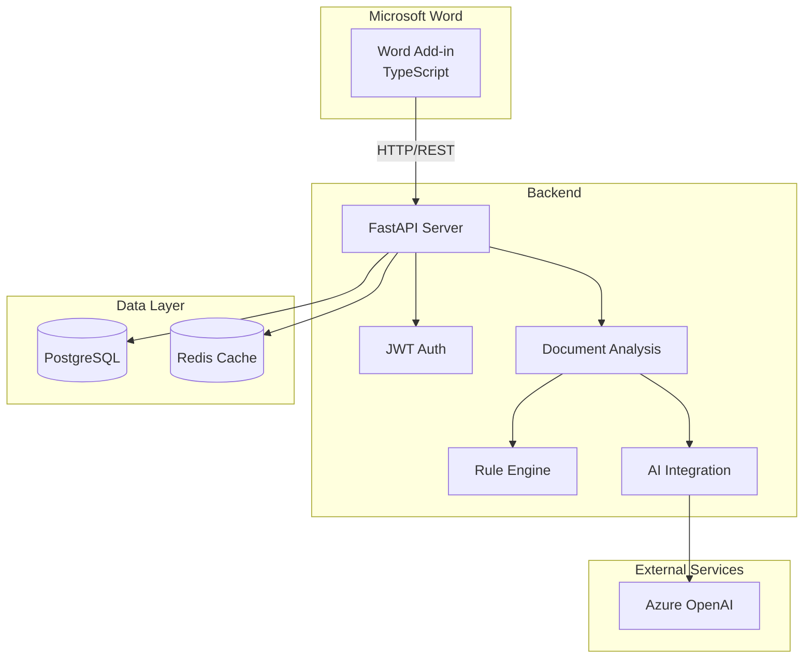
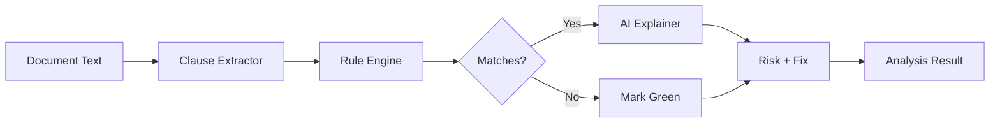
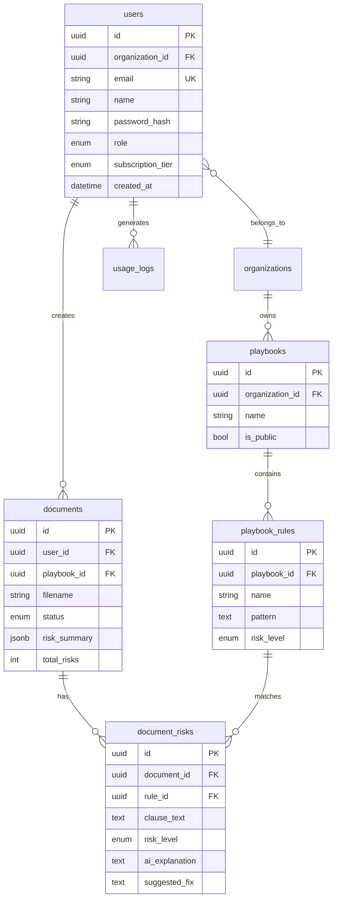

# ContraRed Architecture Documentation

> AI-powered contract redlining Word Add-in with FastAPI backend

---

## 📋 Project Overview

ContraRed is a Microsoft Word Add-in that uses AI to analyze contracts, identify risky clauses, and suggest redlines. The system follows a client-server architecture with a TypeScript Word Add-in frontend and a Python FastAPI backend.

---

## 🏗️ System Architecture



---

## 📁 Project Structure

```
V1 addon word/
├── ContraRed-PoC/          # Word Add-in (TypeScript)
│   ├── src/
│   │   └── taskpane/
│   │       ├── api.ts      # Backend API client
│   │       └── taskpane.ts # Main add-in logic
│   └── manifest.xml        # Add-in manifest
│
└── backend/                # FastAPI Backend (Python)
    ├── main.py             # Application entry point
    ├── app/
    │   ├── api/v1/
    │   │   ├── endpoints/
    │   │   │   ├── auth.py       # Authentication
    │   │   │   ├── documents.py  # Document analysis
    │   │   │   ├── playbooks.py  # Playbook management
    │   │   │   └── users.py      # User management
    │   │   └── router.py
    │   ├── core/
    │   │   ├── config.py         # Settings (Pydantic)
    │   │   └── security.py       # JWT handling
    │   ├── db/
    │   │   └── session.py        # SQLAlchemy async
    │   └── models/
    │       ├── user.py           # User, roles, tiers
    │       ├── organization.py   # Multi-tenant
    │       ├── document.py       # Documents, risks
    │       └── playbook.py       # Rules & playbooks
    └── pyproject.toml
```

---

## ✅ Phase 1 Completion (Current State)

### What's Working

| Component | Status | Details |
|-----------|--------|---------|
| **Backend Server** | ✅ | FastAPI on port 8000 |
| **Authentication** | ✅ | JWT with access/refresh tokens |
| **User Registration** | ✅ | Email + password with bcrypt |
| **Document Analysis** | ⚠️ | Mock implementation (returns sample risks) |
| **OOXML Redlines** | ⚠️ | Mock implementation (template OOXML) |
| **Database** | ✅ | PostgreSQL with async SQLAlchemy |
| **Models** | ✅ | User, Organization, Document, Playbook, Rules |
| **Frontend API Client** | ✅ | TypeScript with token management |

### API Endpoints

| Endpoint | Method | Auth | Description |
|----------|--------|------|-------------|
| `/api/v1/auth/register` | POST | ❌ | Create new user |
| `/api/v1/auth/login` | POST | ❌ | OAuth2 password flow |
| `/api/v1/auth/refresh` | POST | ❌ | Refresh access token |
| `/api/v1/auth/me` | GET | ✅ | Get current user profile |
| `/api/v1/documents/analyze` | POST | ✅ | Analyze document text |
| `/api/v1/documents/redline` | POST | ✅ | Generate OOXML redline |
| `/api/v1/documents/{id}` | GET | ✅ | Get analysis results |
| `/health` | GET | ❌ | Health check |

### Test Credentials

```
Email: test@contrared.ai
Password: Test123!
```

---

## 🚀 Phase 2: Rule Engine + AI Integration

### Overview

Replace the mock document analysis with a real rule-based + AI-powered system.

### Components to Build

#### 1. Rule Engine (`app/services/rule_engine.py`)

```python
# Regex/NLP-based clause detection
class RuleEngine:
    def evaluate(self, text: str, playbook: Playbook) -> List[RuleMatch]:
        # Apply regex patterns from playbook rules
        # Score risk levels based on rule conditions
        pass
```

#### 2. AI Integration (`app/services/ai_service.py`)

```python
# Azure OpenAI integration
class AIService:
    async def explain_risk(self, clause: str, rule: Rule) -> str:
        # Generate human-readable explanation
        pass
    
    async def suggest_fix(self, clause: str, context: str) -> str:
        # Generate suggested redline text
        pass
```

#### 3. Enhanced Document Processor



### Key Features

- [ ] Regex-based rule matching from playbook rules
- [ ] Azure OpenAI GPT-4 for explanations
- [ ] GPT-4 for suggested fix generation
- [ ] Caching with Redis for repeated clauses
- [ ] Token usage tracking for billing

---

## 🔧 Configuration

### Environment Variables

| Variable | Description | Default |
|----------|-------------|---------|
| `DATABASE_URL` | PostgreSQL connection | `postgresql+asyncpg://...` |
| `REDIS_URL` | Redis connection | `redis://localhost:6379/0` |
| `SECRET_KEY` | JWT signing key | (change in production!) |
| `AZURE_OPENAI_ENDPOINT` | Azure OpenAI URL | - |
| `AZURE_OPENAI_API_KEY` | Azure OpenAI key | - |

### Subscription Tiers

| Tier | Scans/Month | Features |
|------|-------------|----------|
| Free | 5 | Basic analysis |
| Pro | Unlimited | Full analysis + playbooks |
| Enterprise | 500 included | Custom playbooks + API |

---

## 🏃 Running the Project

### Backend

```bash
cd backend
pip install -e .
cp .env.example .env
# Start PostgreSQL (Docker)
docker run -d --name contrared-db \
  -e POSTGRES_USER=postgres \
  -e POSTGRES_PASSWORD=postgres \
  -e POSTGRES_DB=contrared \
  -p 5432:5432 postgres:15

uvicorn main:app --reload --port 8000
```

### Frontend (Word Add-in)

```bash
cd ContraRed-PoC
npm install
npm run dev-server
```

### Access Points

- **Swagger UI**: http://localhost:8000/api/docs
- **ReDoc**: http://localhost:8000/api/redoc
- **Word Add-in**: https://localhost:3000/taskpane.html

---

## 📊 Database Schema



---

## 🛠️ Tech Stack

| Layer | Technology |
|-------|------------|
| **Frontend** | TypeScript, Office.js, Webpack |
| **Backend** | FastAPI, Python 3.11+ |
| **Database** | PostgreSQL 15, SQLAlchemy 2.0 (async) |
| **Cache** | Redis |
| **Auth** | JWT (PyJWT), bcrypt |
| **AI** | Azure OpenAI (GPT-4o) |
| **Payments** | Razorpay |

---

*Last Updated: January 12, 2026*
